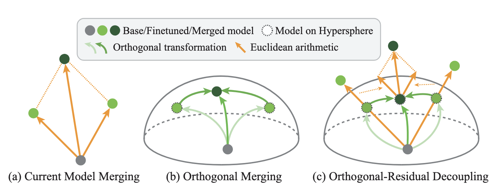

<div align="center">

# Orthogonal Model Merging 

</div>

<p align="center">
  <!-- <b>Authors</b><br> -->
  <a href="https://sihany077.github.io/" target="_blank">Sihan Yang</a>,
  <a href="https://github.com/KexuanShi" target="_blank">Kexuan Shi</a>,
  <a href="https://wyliu.com/" target="_blank">Weiyang Liu</a>
</p>

<p align="center">
  The Chinese University of Hong Kong
</p>

<p align="center">
  <!-- <sup>*</sup>Equal Contribution &nbsp;&nbsp;
  <sup>‡</sup>Project Lead &nbsp;&nbsp;
  <sup>†</sup>Corresponding Author
</p> -->


<p align="center">
  <a href="http://spherelab.ai/OrthoMerge/">🌐 Homepage</a> |
  <a href="https://arxiv.org/pdf/">📑 Paper</a>  |
  <a href="https://arxiv.org/abs/">📖 arXiv</a> |
  <a href="https://huggingface.co/collections/SphereLab/orthomerge">🤗 Models</a> 
</p>


## 🔔News

🔥[2026-02-1]: We released our paper, models, and codes.


## Introduction
We introduce a geometry-preserving model merging framework, called Orthogonal Model Merging (OrthoMerge). For models trained with Orthogonal Finetuning (OFT), the orthogonal matrices representing these transformations are explicit. We map task-specific orthogonal transformations into the Lie algebra, where we perform a magnitude-corrected integration that accounts for both the direction and the intensity of the adaptations. Furthermore, we extend this strategy to models finetuned via standard additive methods (e.g., LoRA, full finetuning), where explicit orthogonal transformations are absent. We introduce an Orthogonal-Residual Decoupling strategy that solves the orthogonal Procrustes problem to extract the implicit orthogonal component from finetuned models. This allows us to merge the orthogonal components of the adaptation on the manifold, while handling the residuals by traditional merging in Euclidean space.


An intuitive comparison among (a) current model merging, the proposed (b) orthogonal merging and (c) orthogonal-residual decoupling merging.


Illustration of OrthoMerge. (a) To merge orthogonal transformations, we first map them to the Lie algebra $\mathfrak{so}(d)$, perform the merging there with magnitude correction to preserve the strength of the transformations, and finally map the result back to the orthogonal group. (b) For general models, we decouple weights into orthogonal and residual components, merging them separately on the Riemannian manifold formed by the orthogonal group and in Euclidean space, respectively.

## Quick Start

### Installation
```
git clone https://github.com/Sphere-AI-Lab/OrthoMerge.git
conda create -n OrthoMerge python=3.10 -y
conda activate OrthoMerge
cd OrthoMerge
pip install -r requirements.txt
```

### Merge
```
# For OFT models
bash scripts/OrthoMerge_OFT_models.sh

# For non-OFT models
bash scripts/OrthoMerge_non_OFT_models.sh
```

### Evaluation
For evaluation environments using [lmms-eval](https://github.com/EvolvingLMMs-Lab/lmms-eval/tree/main), [lm-eval-harness](https://github.com/EleutherAI/lm-evaluation-harness), [bigcode-eval](https://github.com/bigcode-project/bigcode-evaluation-harness), and [safety-eval](https://github.com/nouhadziri/safety-eval-fork), please follow the setup instructions provided in their respective repositories.

```
# For OFT models
bash scripts/OrthoMerge_OFT_models.sh

# For non-OFT models
bash scripts/OrthoMerge_non_OFT_models.sh
```


<!-- ## 🔗 Citation

If you find our work and this codebase helpful, please consider starring this repo 🌟 and cite:

```bibtex
@inproceedings{yang2025mmsi,
  title={MMSI-Bench: A Benchmark for Multi-Image Spatial Intelligence},
  author={Yang, Sihan and Xu, Runsen and Xie, Yiman and Yang, Sizhe and Li, Mo and Lin, Jingli and Zhu, Chenming and Chen, Xiaochen and Duan, Haodong and Yue, Xiangyu and Lin, Dahua and Wang, Tai and Pang, Jiangmiao},
  booktitle={ICLR},
  year={2025}
}
``` -->


## Contact
- Sihan Yang: sihany077@gmail.com