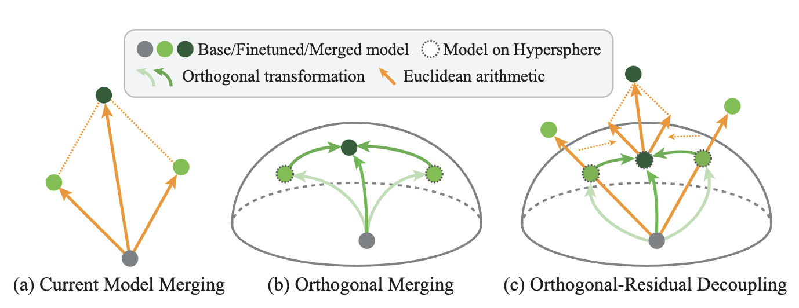
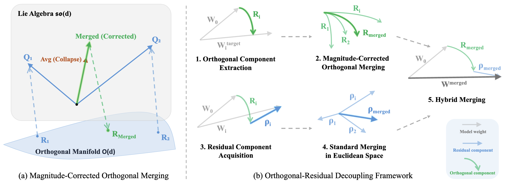

<div align="center">

# Orthogonal Model Merging 

</div>

<p align="center">
  <!-- <b>Authors</b><br> -->
  <a href="https://sihany077.github.io/" target="_blank">Sihan Yang</a>,
  <a href="https://github.com/KexuanShi" target="_blank">Kexuan Shi</a>,
  <a href="https://wyliu.com/" target="_blank">Weiyang Liu</a>
</p>

<p align="center">
  The Chinese University of Hong Kong
</p>

<p align="center">
  <!-- <sup>*</sup>Equal Contribution &nbsp;&nbsp;
  <sup>‡</sup>Project Lead &nbsp;&nbsp;
  <sup>†</sup>Corresponding Author
</p> -->


<p align="center">
  <a href="http://spherelab.ai/OrthoMerge/">🌐 Homepage</a> |
  <a href="https://arxiv.org/pdf/2602.05943">📑 Paper</a>  |
  <a href="https://arxiv.org/abs/2602.05943">📖 arXiv</a> |
  <a href="https://huggingface.co/collections/SphereLab/orthomerge">🤗 Models</a> 
</p>


## 🔔News
🎉[2026-05-01]: OrthoMerge is accepted by ICML 2026.

🔥[2026-02-06]: We released our paper, models, and codes.


## Introduction
We introduce a geometry-preserving model merging framework, called Orthogonal Model Merging (OrthoMerge). For models trained with Orthogonal Finetuning (OFT), the orthogonal matrices representing these transformations are explicit. We map task-specific orthogonal transformations into the Lie algebra, where we perform a magnitude-corrected integration that accounts for both the direction and the intensity of the adaptations. Furthermore, we extend this strategy to models finetuned via standard additive methods (e.g., LoRA, full finetuning), where explicit orthogonal transformations are absent. We introduce an Orthogonal-Residual Decoupling strategy that solves the orthogonal Procrustes problem to extract the implicit orthogonal component from finetuned models. This allows us to merge the orthogonal components of the adaptation on the manifold, while handling the residuals by traditional merging in Euclidean space.


<p align="center">
  
  <br><em>A comparison of (a) current model merging, our (b) orthogonal merging and (c) orthogonal-residual decoupling merging.</em>
</p>

<p align="center">
  
  <br><em>An illustration of OrthoMerge. (a) To merge orthogonal transformations, we first map them to the Lie algebra SO(d), perform the merging there with magnitude correction to preserve the strength of the transformations, and finally map the result back to the orthogonal group. (b) For general models, we decouple weights into orthogonal and residual components, merging them separately on the Riemannian manifold formed by the orthogonal group and in Euclidean space, respectively.</em>
</p>


## Quick Start

### Installation
```
git clone https://github.com/Sphere-AI-Lab/OrthoMerge.git
conda create -n OrthoMerge python=3.10 -y
conda activate OrthoMerge
cd OrthoMerge
pip install -r requirements.txt
```
### Models for Merging Experiments

We utilize the following base models and task-specific fine-tuned models for our experiments.

#### 1. Merging OFT Models
*   **Base Model:** [meta-llama/Llama-3.1-8B](https://huggingface.co/meta-llama/Llama-3.1-8B)
*   **Task-Specific Adapters:** [SphereLab/Llama-3.1-8B_OFT_adapters](https://huggingface.co/SphereLab/Llama-3.1-8B_OFT_adapters)

#### 2. Merging Non-OFT Models

**Llama 3.2 Experiments:**
*   **Base Model:** [meta-llama/Llama-3.2-3B](https://huggingface.co/meta-llama/Llama-3.2-3B)
*   **Task-Specific Models:** [MergeBench Collection (Llama-3.2-3B)](https://huggingface.co/collections/MergeBench/llama-32-3b-models)

**Qwen 2.5 VL Experiments:**
*   **Base Model:** [Qwen/Qwen2.5-VL-7B-Instruct](https://huggingface.co/Qwen/Qwen2.5-VL-7B-Instruct)
*   **Task-Specific Models:**
    *   [allenai/olmOCR-2-7B-1025](https://huggingface.co/allenai/olmOCR-2-7B-1025)
    *   [sensenova/SenseNova-SI-1.1-Qwen2.5-VL-7B](https://huggingface.co/sensenova/SenseNova-SI-1.1-Qwen2.5-VL-7B)
    *   [FreedomIntelligence/HuatuoGPT-Vision-7B-Qwen2.5VL](https://huggingface.co/FreedomIntelligence/HuatuoGPT-Vision-7B-Qwen2.5VL)


### Merge
```
# For OFT models
bash scripts/OrthoMerge_OFT_models.sh

# For non-OFT models
bash scripts/OrthoMerge_non_OFT_models.sh
```

#### Replace SVD with Newton–Schulz Iteration

The SVD-based layer-wise Procrustes step is highly time-consuming, especially for larger models. To speed up this step, the original SVD-based solver can be replaced with Newton–Schulz (NS) iteration. NS iteration significantly improves efficiency while maintaining comparable performance.

##### Original SVD version

```python
def orthogonal_procrustes_torch_right(W1: torch.Tensor, W0: torch.Tensor) -> torch.Tensor:
    # Find R such that W0 @ R ≈ W1
    A = torch.matmul(W0.t(), W1)
    U, _, Vh = torch.linalg.svd(A, full_matrices=False)
    return torch.matmul(U, Vh)
```

##### Newton–Schulz version

```python
def orthogonal_procrustes_torch_right(
    W1: torch.Tensor,
    W0: torch.Tensor,
    steps: int = 5,
) -> torch.Tensor:
    # Find R such that W0 @ R ≈ W1
    G = torch.matmul(W0.t(), W1)

    # Newton-Schulz coefficients
    a, b, c = 3.4445, -4.7750, 2.0315

    # Use fp32 for numerical stability
    X = G.float()

    # Normalize before iteration
    X /= X.norm() + 1e-7

    # Usually G is square; keep this for rectangular safety
    transposed = False
    if X.size(0) > X.size(1):
        X = X.T
        transposed = True

    for _ in range(steps):
        A = X @ X.T
        B = b * A + c * (A @ A)
        X = a * X + B @ X

    if transposed:
        X = X.T

    return X.to(G.dtype)
```

### Evaluation
For evaluation environments using [lmms-eval](https://github.com/EvolvingLMMs-Lab/lmms-eval/tree/main), [lm-eval-harness](https://github.com/EleutherAI/lm-evaluation-harness), [bigcode-eval](https://github.com/bigcode-project/bigcode-evaluation-harness), and [safety-eval](https://github.com/nouhadziri/safety-eval-fork), please follow the setup instructions provided in their respective repositories.

```
# For OFT models
bash scripts/OrthoMerge_OFT_models.sh

# For non-OFT models
bash scripts/OrthoMerge_non_OFT_models.sh
```


##  Citation

If you find our work and this codebase helpful, please consider starring this repo and cite:

```bibtex
  @InProceedings{yang2026orthomerge,
      title={Orthogonal Model Merging},
      author={Yang, Sihan and Shi, Kexuan and Liu, Weiyang},
      booktitle={ICML},
      year={2026}
  }
```


## Contact
- Sihan Yang: sihany077@gmail.com
